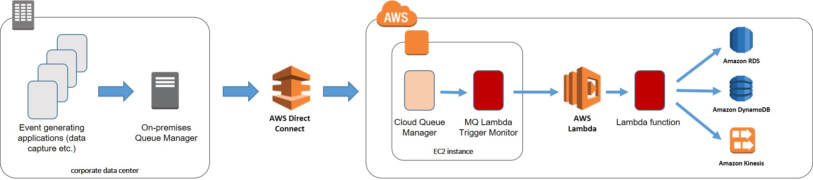

# Overview

IBM MQ Trigger Monitor for AWS Lambda (`mqlambdatm` for short) is a small component that glues together IBM MQ messaging infrastructure and Amazon AWS Lambda. It is intended to provide additional integration and deployment options for enterpise/corporate IT environments that gradually deploy new workloads on AWS. A typical requirement in such settings is pushing near-real time events generated inside the corporate network to consumers on AWS. Since IBM MQ is ubiquitous in corporate environments, a natural approach would be utilizing MQ messaging backbone to deliver the event messages. But MQ by itself will deliver the messages to a queue manager running on an EC2 instance, and it falls with the application developers and architects to provide "the last mile" solution - picking up messages from the queues and pushing them to the intended destinations.

The question then remains how those applications are to be deployed and managed. Of course there are traditional options - running them alongside the queue manager in the same EC2 instance or employing dedicated instances, with or without containers. `mqlambdatm` opens an additional option of *serverless deployment* of these applications.

A broad view of a possible deployment of MQ Trigger Monitor for AWS Lambda:



This document currently does not provide explanations on IBM MQ triggering mechanism. You can find them in [IBM MQ documentation on triggering](https://www.ibm.com/support/knowledgecenter/SSFKSJ_9.0.0/com.ibm.mq.dev.doc/q026910_.htm)

# Obtaining MQ Trigger Monitor for AWS Lambda

Download latest release [here](https://github.com/yurist/mqlambdatm/releases/latest). Download `mqlambdatm.tar.gz` and unzip it using `tar -xvf`. Copy the executable `mqlambdatm` to any directory according to your conventions.

# Running MQ Trigger Monitor for AWS Lambda.

    Usage of mqlambdatm:
    -log-level string
            log level (DEBUG, INFO, WARN, ERROR, FATAL, PANIC) (default "info")
    -m string
            queue manager to connect, default queue manager if not given
    -q string
            initiation queue to serve

The recommended way of running trigger monitors is by using MQ services, see [example configuration](https://github.com/yurist/mqlambdatm-demo/blob/master/demo/cloud-init/docker/config.mqsc) in MQ Lambda Trigger Monitor sample repository.

# Building from sources

The machine for building `mqlambdatm` must have IBM MQ SDK installed in the default location.

You need Go development environment. See [here](https://golang.org/doc/install) for the details. You also need `gcc` compiler.

After installing Go tools and setting the environment variables, run

``` 
go get github.com/yurist/mqlambdatm
```

You will find `mqlambdatm` executable in $GOPATH/bin.

# Developing Lambda functions for use with MQ triggering

See [MQ Lambda Trigger Monitor Sample project](https://github.com/yurist/mqlambdatm-demo) for a complete sample.

# Support

I will be glad to provide clarifications and fixes on the best effort basis. Please [open an issue](https://github.com/yurist/mqlambdatm/issues) if you need help.

# License

[Apache License, Version 2.0](http://apache.org/licenses/LICENSE-2.0.html)
